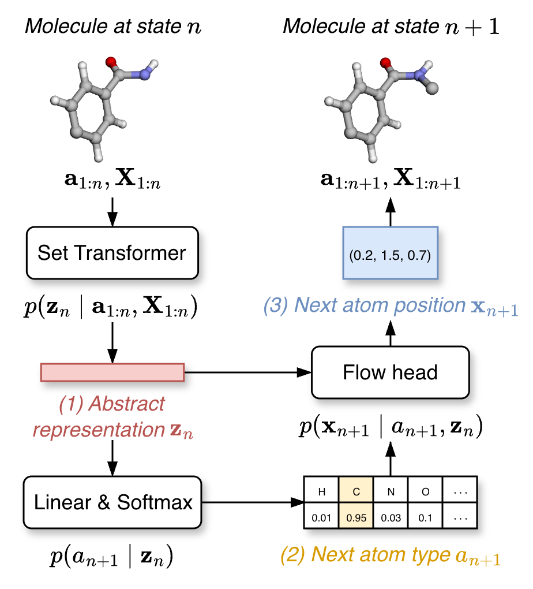

# NEAT: <ins>N</ins>eighborhood-Guided, <ins>E</ins>fficient, <ins>A</ins>utoregressive Set <ins>T</ins>ransformer for 3D Molecular Generation

<p align="center">
  
</p>


Welcome to the NEAT repository. NEAT is an autoregressive model that builds 3D molecules one atom at a time using a set transformer. It feeds the transformer’s output into a flow model to predict where the next atom should be by modeling the probability over its possible positions. The animation below shows how simple Gaussian noise is gradually transformed via the learned vector field into a distribution that represents the next atom’s location.

<p align="center">
  
</p>

# Installation

1. Clone the repository and cd into the repository's root:

```bash
git clone https://github.com/molinfo-vienna/NEAT.git
cd NEAT
```

2. Create and activate an environment with the required python version:

```bash
conda create --name neat python=3.11
conda activate neat
```

3. Install PyTorch and PyTorch-Geometric according to your hardware. For example, with GPU and CUDA 13.0 on Linux:

```bash
pip install torch==2.9.0 --index-url https://download.pytorch.org/whl/cu130
```

For more info, visit https://pytorch.org/get-started/locally.

4. Install NEAT:

```bash
pip install .
```

5. Get trained model weights:

```bash
python scripts/get_weights.py
```

Alternatively you can download the trained model weights manually from [figshare](https://figshare.com/s/8291194090f2133fac63). Unzip and place into a `trained_models` folder for using the generation script without modifications to the `config_generation.yaml` configuration file.

# Usage

## Generate molecules

1. Open `config_generation.yaml` and set the chosen options:

- checkpoints_path: model checkpoints folder
- output_path: output folder
- data_set: "QM9" or "GEOM"
- num_molecules: number of generated molecules
- batch_size: batch size according to hardware (generating 1000 GEOM molecules requires approx. 12GB of VRAM on the GPU)
- max_atoms: the maximum number of atoms per generated molecules
- num_time_steps: number of flow matching integration time steps
- num_runs: number of runs with different random seeds
- time_step_spacing: method of time-step spacing ("linear", "logarithmic", or "quadratic")
- integration_method: integration method to use for flow matching ("euler" or "euler-maruyama")

2. Run:

```bash
python scripts/generation.py
```

3. What you get:

- Generated molecules stored in a `generated_mols.pt` file.


## Complete prefixes

1. The `prefixes` directory contains an SD file with all prefixes. Prefixes are UFF-optimized molecules with an <R_group_indices> property. The corresponding list of indices (indexing starts with 0) points to H-Atoms that will be removed. The resulting prefixes are used as starting points for 3D molecular generation. The provided file is used by default when running `generation_prefix.py`. To generate prefixes from the GEOM-Drugs training set yourself, run:

```bash
python scripts/prefixes_from_geom.py
```
You could equally modify this script to generate your own prefixes.

2. Open `config_generation.yaml` and configure as described above in ***Generate molecules***.

3. Run:

```bash
python scripts/generation_prefix.py
```

4. What you get:

- Completed molecules stored in a `generated_mols.pt` file for each of the prefixes (100 prefixes if using the default GEOM prefixes).


## Evaluate generated molecules or completed prefixes

1. Open `config_evaluation.yaml` and set the chosen options:

- data_path: folder of the generated_mols.pt file obtained either from unconditional molecular generation or prefix completion. Example: "output/generated_best_geom/unconditional" or "output/generated_best_geom/prefix"
- data_set: "QM9" or "GEOM"
- compute_novelty: Novelty is computed using the training set SMILES. If set to true, it will trigger the data-processing pipeline (if you haven’t run it yet). If you only want to try the model without processing data, leave this option set to false.

2. Run:

```bash
python scripts/evaluation.py
```

3. What you get:

- Metrics per seed/prefix.
- Average across all seeds/prefixes with 95% confidence intervals.
- 2D and 3D visualizations of the first 100 molecules for each seed/prefix.


## Train model

1. Open `config_training.yaml` and set the chosen options:

- accumulate_grad_batches: number of steps before gradient accumulation
- batch_size
- bias: boolean controlling the use of bias in key-query-value projection layers
- data_set: "QM9" or "GEOM"
- dropout: dropout probability
- learning_rate: initial learning rate of the AdamW optimizer
- lr_decay_epochs: total number of epochs during which learning rate decay is applied
- lr_min_ratio: final ratio of initial learning rate to reach after learning rate decay
- lr_warmup_epochs: number of epochs for linear learning rate warmup
- max_epochs: total number of training epochs
- n_embd: size of the transformer layers
- n_embd_fm: size of the flow matching layers
- n_head: number of attention heads
- n_layer: number of transformer layers
- n_layers_fm: number of layer in the flow matching head
- noise_std: standard deviation of the initial Gaussian noise in the flow matching process
- rope: boolean controlling the use of rotary positional embeddings
- time_step_resampling: number of resampled trajectories when computing flow-matching loss
- time_step_sampling: distribution for time step sampling ("logit_normal" or "uniform")
- weight_decay: weight decay parameter of the AdamW optimizer

2. Run:

```bash
python scripts/training.py
```

This script supports training on both the QM9 and the GEOM-Drugs dataset. Executing it will download the QM9 and GEOM-Drugs data from https://ndownloader.figshare.com/files/3195389 (QM9) or https://bits.csb.pitt.edu/files/geom_raw (GEOM), place it into either data/QM9/raw or data/GEOM/raw, process the data, and save the processed files in either data/QM9/processed or data/GEOM/processed. Should the file have been downloaded and processed already, these steps will be skipped.

3. What you get:

- Model checkpoints (best validation loss and best validation validity) saved in a `logs/NEAT/version_X/checkpoints` folder, along with a copy of the configuration file. The version_X folder's path should be used when loading the model's checkpoints for generating molecules or completing prefixes.


# License

This project is licensed under the MIT license.


